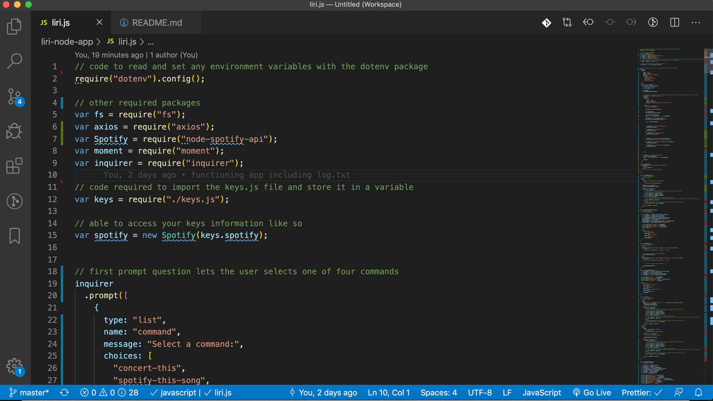

# liri-node-app

## LIRI Bot 
Coding Bootcamp Homework #10: Introduction to Node.js

### Link to GitHub Code
https://github.com/pamelac08/liri-node-app

### Technical Description

* Clearly state the problem the app is trying to solve (i.e. what is it doing and why)
    - This application is a command line node app
    - The app will take in  user input and return a response as programmed

* Give a high-level overview of how the app is organized
    - once initiated, the user will be prompted to choose one of four commands
    - the app will then return data as requested
  
* Give start-to-finish instructions on how to run the app
  - once the app is run, the user is prompted to choose one of four commands
  - if user selects "do-what-it-says", the app will complete as programmed
  - if anything else is selected, user will be prompted to enter an item to search
  - then the app will return a response as  programmed

* Clearly list the technologies used in the app
    - Inquirer prompt method
    - NPM packages
    -  Javascript/jQuery 
        - data validation
        - conditional statements
        - API calls/AJAX
        -  for loops

* Technical Approach

###  Screenshots/video

